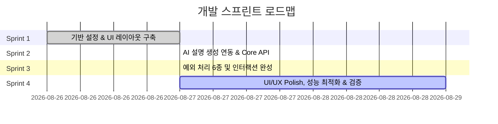

# 보안 용어 쉬운 비유 설명 서비스 — 개발 계획서 (Development Plan)

> **문서 버전**: v1.1.0  
> **최종 수정일**: 2026-08-27  
> **기반 문서**: [PRD.md](../PRD.md)

---

## 1. 개요 (Overview)

본 개발 계획서는 `PRD.md`에 정의된 요구사항을 바탕으로, **보안 전공 초보자 및 교육생을 위한 단일 화면 보안 용어 비유 설명 서비스**를 단계별(스프린트 단위)로 구축하기 위한 구체적인 가이드를 제공합니다.

---

## 2. 개발 로드맵 및 스프린트 구성

전체 개발 과정은 총 **4개의 스프린트(Sprint)**로 구분하여 추진합니다.

---

## 3. 스프린트별 상세 계획 (Sprint Specification)

### 🚀 Sprint 1: 프로젝트 기반 설정 & 단일 화면 UI 레이아웃 (Visual Foundation) [완료 ✅]

* **상태**: **완료 (Completed)** (2026-08-27)
* **목표**: 1 Screen 핵심 UI 뼈대 구축, 컴포넌트 모듈화, 빈 입력 예외 처리 UI 구현
* **주요 성과**:
  1. **디자인 시스템 및 레이아웃**:
     - Modern & Premium 다크/글래스모피즘 테마 및 Google Fonts(`Noto Sans KR`, `Outfit`, `Gowun Batang`) 연동 완료
     - 단일 화면 메인 레이아웃 (`app/page.tsx`) 구축
  2. **핵심 UI 컴포넌트 분리**:
     - `SearchBar`: 입력창, 검색 버튼, Enter 키 바인딩 (한글 IME 중복 방지), 포커스 제어
     - `ResultCard`: 용어명, ①한 줄 정의, ②일상 비유 설명, ③보안 역할 설명
     - `StatusIndicator`: 로딩 스피너 및 각 상태(`initial`, `loading`, `irrelevant`, `typo`, `error`, `delayed`) 메시지 패널 통합
  3. **기초 상태 관리**:
     - `idle/initial`, `loading`, `result`, `irrelevant`, `typo`, `error`, `delayed` 상태 연동
  4. **[5-1] 빈 입력 예외 처리**:
     - 빈 입력 시 검색 방지, `"검색어를 입력해주세요"` 안내 문구, `animate-shake` 미세 경고 및 포커스 유지 처리 완료

---

### ⚡ Sprint 2: AI 설명 생성 엔진 & Core API 연동 (Engine & Response) [완료 ✅]

* **상태**: **완료 (Completed)** (2026-08-27)
* **목표**: 입력된 보안 용어를 해석하여 3초 이내 3요소(정의/비유/역할)를 생성해내는 API 연동 및 타임아웃 처리
* **주요 성과**:
  1. **Google Gemini API 연동 설정**:
     - `GEMINI_API_KEY` 환경 변수 구성 및 `gemini-2.5-flash` / `gemini-2.0-flash` 모델 연동
     - API 키 부재 또는 외부 오류 시 로컬 사전(`lib/mock-terms.ts`) 자동 폴백 메커니즘 구축
  2. **API Route 구축 (`/api/explain`)**:
     - 프롬프트 엔지니어링 및 `responseMimeType: 'application/json'` 응답 강제 (① 한 줄 정의, ② 일상 비유 설명, ③ 보안 역할 3요소)
     - 검색어 및 재생성 시드별 인메모리 결과 캐싱(`cacheMap`) 최적화
  3. **[5-5] 응답 지연 및 타임아웃 핸들링**:
     - 3초 경과 시 `"설명을 찾고 있어요…"` 로딩 상태 유지
     - 10초 초과 시 Client AbortController 요청 자동 취소 ➔ `"응답이 지연되고 있어요. 다시 시도해주세요."` 상태 및 재시도 버튼 노출 연동 완료

---

### 🛡️ Sprint 3: 예외 처리 6종 완비 & 인터랙션 구현 (Exception & Resilience) [완료 ✅]

* **상태**: **완료 (Completed)** (2026-08-27)
* **목표**: `PRD.md` 5절에 명시된 6가지 예외 상황을 100% 충실히 처리
* **주요 성과**:
  1. **[5-1] 빈 입력 방지**: 공백 입력 차단, `"검색어를 입력해주세요"` 안내, `animate-shake` 및 포커스 유지.
  2. **[5-2] 보안 무관/미존재 용어**: AI/Fallback 판단으로 `" '떡볶이는' 보안 용어로 보이지 않아요."` 안내 및 추천 용어 칩 (피싱, VPN, 랜섬웨어 등) 클릭 시 즉시 재검색.
  3. **[5-3] 오탈자 보정 및 추천**: 유사 용어 대조 ➔ `"혹시 '피싱을' 찾으시나요?"` 추천 버튼 제시 및 원클릭 자동 보정 재검색.
  4. **[5-4] AI/API 생성 실패 대응**: `ErrorPanel` 에러 상태 전환 및 **[다시 시도]** 버튼을 통해 동일 검색어 손쉬운 재요청.
  5. **[5-5] 응답 지연 및 타임아웃 핸들링**: 10초 `AbortController` 자동 취소 후 `DelayedPanel` 및 **[다시 시도]** 버튼 제공.
  6. **[5-6] 결과 재시도 요구**: 결과 카드 하단 **[다른 설명으로 다시 보기]** 상시 제공 ➔ 동일 용어 AI 재생성/variant 시드 변경 및 로딩 스켈레톤 트랜지션 완료.

---

### ✨ Sprint 4: Visual Polish, 반응형 최적화 & 최종 검증 (Polish & Quality Assurance)

* **목표**: 3초 이내 응답 확인, 모바일/데스크톱 반응형 완벽 대응 및 품질 검증
* **주요 과제**:
  1. **UX Micro-animations**:
     - 결과 출력 시 Fade-in / Slide-up 애니메이션 적용
     - 로딩 스피너 및 Skeleton UI 적용으로 체감 대기 시간 축소
  2. **완료 조건 (Checklist) 검증**:
     - [x] 단일 화면에서 3요소(정의/비유/역할) 출력 흐름 검증
     - [x] 회원가입/로그인/결제/DB저장 기능 불필요 검증
     - [x] 예외 처리 6종 전체 동작 검증
     - [x] 3초 이내 빠른 응답 속도 체감 및 타임아웃 동작 검증

---

## 4. 관리 및 유지보수 가이드 (Maintenance Plan)

- 본 계획서는 개발 진행 상황에 맞춰 `docs/` 디렉토리 내에서 업데이트됩니다.
- 각 스프린트 완료 시 `walkthrough.md`에 시각적 verification 결과를 기록합니다.
